# JSP规范

---

> JSP规范来自于JAVAEE规范中的一种
>
> JSP规范制定了如何开发JSP文件代替响应对象将处理结果写入到响应体的开发流程
>
> JSP规范制定了Http服务器应该如何调用JSP文件

🙋 响应对象存在那些弊端？

* 适合将数据量较少的处理结果写入到响应体
* 如果处理结果数量过多，使用响应对象会增加开发难度

----

## 在JSP文件中书写Java命令

JSP文件中，只有执行标记中的内容才会被当成为Java命令

```jsp
<%@ page contentType="text/html;charset=UTF-8" language="java" %>
<%
    //在JSP文件中，只有在执行标记中的内容才会被当做java命令
    //1. 声明变量
    int num1 = 100;
    int num2 = 200;
    //2. 声明运行表达式、数学表达式、关系运算、逻辑运算
    int num3 = num1 + num2;
    int num4 = num1>=num2?num1:num2;
    boolean num5 = num2>=100&&num1>=200;
    //3. 声明控制语句
    if(num2>num1){

    }else{

    }

    for(int i = 1; i < 10; i++){

    }
%>
```

```jsp
<!--在JSP文件，通过输出标记，通知JSP将Java变量的值写入到响应体-->
变量num1的值：<%=num1%><br/>
变量num2的值：<%=num2%><br/>
<!--执行标记还可以通知JSP将运算结果写入响应体-->
num1 + num2 = <%=num1+num2%>
```

```jsp
<!--在JSP文件中创建对象并调用对象的方法-->
<%@ page import="com.nihachi.entity.Student" %>
<%
    Student stu = new Student(1);
%>

His name is <%=stu.getAge()%>
```

☁️ 在JSP中会将所有的执行标记看作为一个整体，所以可以书写例如以下形式的判断语句：

```jsp
<%
	int age = 10;
%>
<% if(age >= 15){
%>
	<font style="color:red;font-size:45px">热烈欢迎</font>
<%
}else{
%>
	<font style="color:red;font-size:45px">谢绝入内</font>
<%
}
%>
```

利用for循环输出表格：

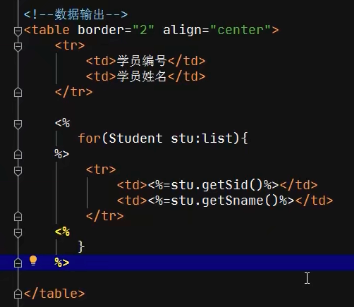

🙋 相比在Servlet中要相对简洁

---

## JSP的内置对象

### JSP的内置对象request

> JSP文件内置对象：request
>
> * 类型：HttpServletRequest
> * 作用：
>   * 在JSP文件运行时读取请求包信息
>   * 与Servelt在请求转发过程中实现数据共享

```jsp
<!--浏览器：http://localhost:8080/myWeb/request.jsp?userName=Allen&password=123-->
<%
    //在JSP文件执行时，借助于内置的request对象读取请求包参数信息
    String userName = request.getParameter("userName");
    String password = request.getParameter("password");
%>
来访用户账号：<%=userName%>
来访用户密码：<%=password%>
```

---

### JSP的内置对象session

> JSP文件内置对象：session
>
> * 类型：HttpSession
> * 作用：
>   * JSP文件在运行时，可以session指向当前用户私人储物柜，添加共享数据，或则读取共享数据

```jsp
<% page contentType="text/html;charset=UTF-8" language="java" %>
<!--将共享数据添加到当前用户私人储物柜-->

<%
    //HttpSession session = request.getSession();
    session.setAttribute("key1",200);
%>
```

```jsp
<%
    Integer value = (Integer) session.getAttribute("key1");
%>
session2从当前用户的session中读取的数据为：<%=value%>
```

----

### JSP的内置对象application

> ServeltContext application；全局作用域对象
>
> 同一个网站中Servlet与Jsp都可以通过当前网站的全局作用域对象实现数据共享
>
> JSP文件内置对象：applicaiton

```java
@WebServlet(name = "oneServlet", value = "/oneServlet")
public class oneServlet extends HttpServlet {
    @Override
    protected void doGet(HttpServletRequest request, HttpServletResponse response) throws ServletException, IOException {
        ServletContext application = request.getServletContext();
        String value = (String) application.getAttribute("key2");
        System.out.println("value:" + value);
    }
}
```

```jsp
<%@ page contentType="text/html;charset=UTF-8" language="java" %>
<%
    application.setAttribute("key2","hello world");
%>
```

---

## JSP与Servlet的关系

1. Servlet与JSP分工
   * Servlet：负责处理业务并得到处理结果
   * JSP：不负责业务处理，主要任务将Servlet中处理结果写入到响应体
2. Servlet与JSP之间调用关系
   * Servlet工作完毕后，一般通过请求转发方式向Tomcat申请调用JSP
3. Servlet与JSP之间如何实现数据共享
   * Servlet将处理结果添加到请求作用域对象
   * JSP文件在运行时从请求作用域对象得到处理结果

---

## JSP文件运行原理

Http服务器调用JSP文件步骤：

1. Http服务器将Jsp文件内容【编译】为一个Servlet接口实现类（.java）
2. Http服务器将Servlet接口实现类【编译】为class文件（.class）
3. Http服务器负责创建这个class实例对象，这个实例对象就是Servlet实例对象
4. Http服务器通过Servlet实例对象调用jsp_service方法，将Jsp文件内容写入到响应体

☁️ JSP生成的.class文件在Tomcat目录下work文件夹内

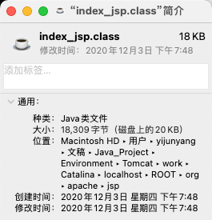


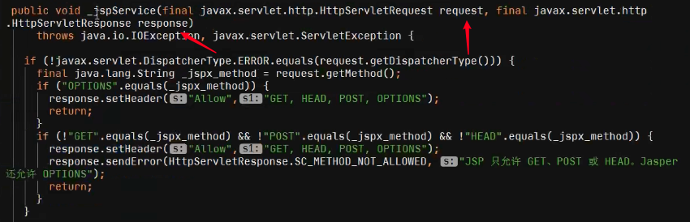

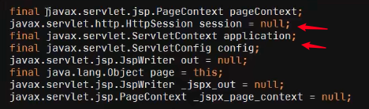

上述文件中有了请求作用域变量、响应作用域变量、回话变量以及全局作用域变量，其中请求变量和响应变量来自于servlet接口实现类中的doGet方法中的dispatcher.forward....

关于生成的.java文件是如何转化的，以if-else语句为例：

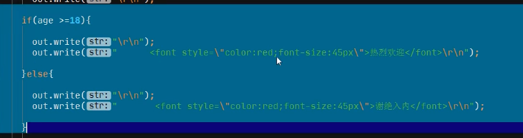

---

## 利用JSP完成一个试题的添加功能

🙋 Tomcat中使用JDBC的时候，主要要将mysql的jar包放入到WEB-INF目录下的lib文件夹下才可以成功使用，否则即使编译过程中成功也会在执行过程中失败，报错情况为 -- java.lang.ClassNotFoundException: com.mysql.cj.jdbc.Driver。（[具体问题及解决方法可参考](https://blog.csdn.net/qq_45895576/article/details/111240946)）

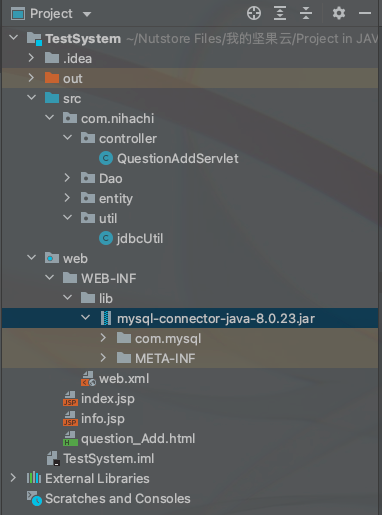

---

## EL技术

> 由Java技术开发的一个jar包
>
> 作用：降低了JSP文件开发过程中Java命令的开发强度
>
> Tomcat服务器自带有EL工具包（lib目录下的el-api.jar）

使用JSP的作用是将Servlet中doGet/doPost方法所得到的的内容写入到的响应体中

JSP的主要开发步骤：

```jsp
<%
		String value = (String)request.getAttribute("key");
%>
<%=value>
```

1. 从指定的作用域对象中读取处理结果
2. 将得到的数据进行类型强转（作用域对象保存数据的方法是以map的方式进行保存，从map中读取数据得到的类型为object类型）
3. 将转换后的数据写入到响应体

🙋 以上步骤较为繁琐，所以需要改进，如下图：

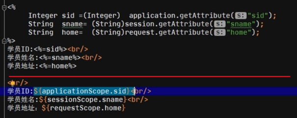

**上方为传统jsp书写方法，下方为EL技术书写方法**

### EL表达式

1. 命令格式：${作用域对象别名.共享数据}
2. 作用：
   * EL表达式是EL工具包提供的一种特殊命令格式【表达式命令格式】
   * EL表达式在JSP文件上使用
   * 负责在JSP文件上从作用域对象读取指定的共享数据并输出到响应体

### EL表达式作用域对象别名

1. JSP文件可以使用的作用域对象

   * ServletContext.             application： 全局作用域对象
   * HttpSession                  seesion：会话作用域对象
   * HttpServletRequest      request：请求作用域对象
   * PageContext                 pageContext：当前页作用域对象
     * 这是JSP文件独有的作用域对象，Servlet中不存在
     * 在当前页作用域对象存放的共享数据仅能在当前JSP文件中使用，不能共享给其他Servlet或其他Jsp文件
     * 真实开发中，主要用于JSTL标签与Jsp文件之间数据共享
     * JSTL----(数据)----->pageContext---->JSP

2. EL表示大提供的作用域对象别名

   | JSP         | EL表达式                       |
   | ----------- | ------------------------------ |
   | application | ${applicationScope.共享数据名} |
   | session     | ${sessionScope.共享数据名}     |
   | request     | ${requestScope.共享数据名称}   |
   | pageContext | ${pageScope.共享数据名称}      |

### EL表达式将引用变量写入响应体

```jsp
//假设有Student类，保存于key键中，含有属性sid，则有：
学员编号：${requestScope.key.sid}<!--sid来自Student类的属性，大小写完全一致--->
学院姓名：${requestScope.key.sname}
```

1. 命令格式：${作用域对象别名.共享数据名.属性名}
2. 命令作用：从作用域对象读取指定共享数据关联的引用对象的属性值，并自动将属性的结果写入到响应体
3. 属性名：一定要去引用类型属性名完全一致（大小写）

☁️ EL表达式不具备遍历的功能，所以无法从作用域对象中读取集合内容输出（之后会由JSTL补充）

### EL表达式简化版

1. 命令格式：${共享数据名}

2. 命令作用：EL表达式简化版允许开发人员开发时省略作用域对象别名

3. 工作原理：EL表达式简化版由于没有指定作用域对象，所以在执行时采用【猜】的算法

   * 首先到【pageContext】定位共享数据，如果存在直接读取输出并结束执行
   * 如果上述内容没有成功定位，则到【request】定位
   * 如果【request】失败，则到【session】
   * 如果【session】失败，则到【application】
   * 如果【application】也失败，则返回null

4. 存在隐患：

   * 容易降低程序的执行速度【南辕北辙】

   * 容易导致数据定位错误

5. 应用场景

   设计目的 —— 简化从pageContext读取共享数据并输出的难度

6. EL表达式简化版尽管存在了很多隐患，但是在实际开发过程中，开发人员为了节约时间还是使用简化版

### EL表达式 —— 支持运算表达式

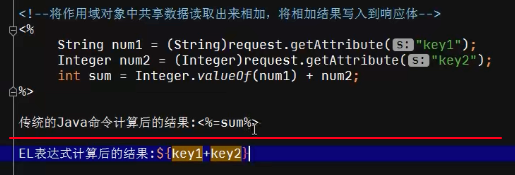

在JSP文件有时需要将读取共享数据进行一番运算之后，将运算结果写入到响应体

支持的运算表达式：

1. 数学运算

2. 关系运算

   | >    | >=   | ==   | <    | <=   | !=   |
   | ---- | ---- | ---- | ---- | ---- | ---- |
   | gt   | ge   | eq   | lt   | le   | !=   |

   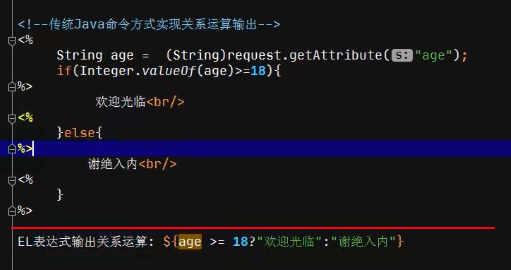

3. 逻辑运算

   &&  ||  ！

### EL表达式提供的内置对象

1. 命令格式：${param.请求参数名}

2. 命令作用：通过请求参数读取当前请求包中请求参数内容，并将请求参数内容写入到响应体

3. 代替命令：

   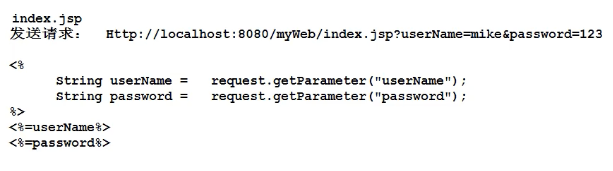


1. 命令格式：${paramValues.请求参数名[下标]}

2. 命令作用：如果浏览器发送的请求参数是一个请求参数关联多个值，此时可以通过paramValues读取请求参数下指定位置的值，并写入响应体

3. 代替命令：

   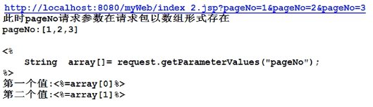

☁️ 由于浏览器一般把参数都发给Servlet，所以以上两个命令不太用的上。

---

## 互联网通信流程

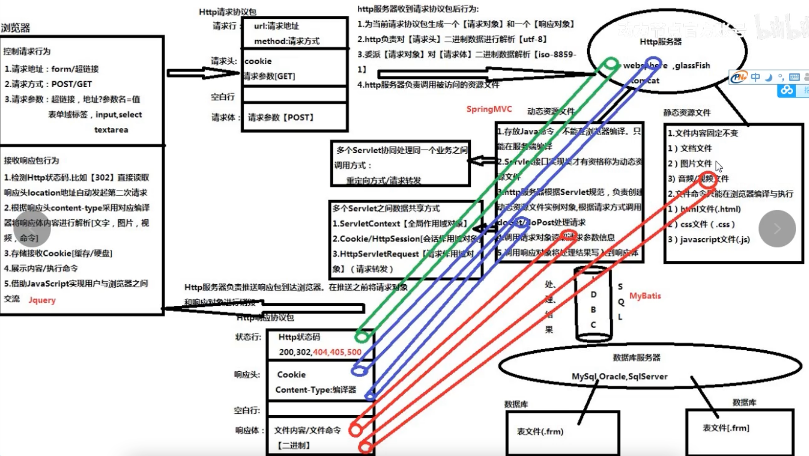

