# JavaScript

---

> JavaScript是一种专门在浏览器编译并执行的编程语言
>
> JavaScript主要是用来处理用户与浏览器之间的请求问题
>
> JavaScript采用【弱类型编程语言风格】对【面向对象思想】来进行实现的编程语言

## 弱类型语言风格 vs 强类型语言风格

1. 强类型编程语言风格：认为对象行为应该受到其修饰类型严格约束。

   * Java是采用【强类型编程语言风格】对【面向对象思想】来进行实现的编程语言

     ```java
     Class Student{
     	public String sname;
     	public void sayHello(){
     		System.out.print("Hello world");
     	}
     }
     Stduent stu = new Student();	//只能调用该属性
     stu.sname = "mike";	//只能调用该方法
     stu.sid = 10; //语法错误，修饰stu对象的student类型没有这个属性
     ```

     

2. 弱类型编程语言风格：认为对象行为不应该受到其修饰类型的约束，可以根据实际需要来决定。对象可以调用属性和方法。

   * JavaScript是采用【弱类型编程语言风格】对【面向对象思想】来进行实现的编程语言

     ```javascript
     var stu = new Object();
     stu.car = "劳斯莱斯";
     stu.play = function(){return "天天打游戏"}
     stu.play;
     ```

---

## 变量声明方式

1. 命令格式

   * var 变量名;
   * var 变量名 = 值;
   * var 变量名1, 变量名2 = 值;

2. 注意

   在JavaScript变量/对象，声明不允许指定【修饰类型】

   只能通过var来进行修饰

   命令行可以以分号结尾，可以省略

```javascript
<body>
    <!--script标签在html文件，可以再任意位置出现-->
    <script type="text/javascript">
        //浏览器在收到html文件之后，自动对<script>标签中javascript命令进行编译与执行
        var num1 = 200;
        var num2 = 300;
        var num3 = num1 + num2;
        window.alert("num3 = "+num3);
    </script>
</body>
```

---

## 标识符命名规则

🙋 只能由四种符号组成：英文字母、数字、下划线、美元符号（$）

标识符首字母不能以“数字”开头

标识符不能采用javascript关键词，比如var

---

## 数据类型

1. 分类：基本数据类型 & 高级引用数据类型
2. 基本数据类型：
   * 数字类型（number）
     * JavaScript中将整数与小数合称为number类型
   * 字符串类型（String）
     * JavaScript中字符与字符串合称为string类型、字符或者字符串既可以用''又可以用""
   * 布尔类型（boolean）
     * JavaScript中布尔类型只有true或者false
3. 高级引用数据类型
   * object类型
     * 所有通过【构造函数】生成的对象都是object类型
   * function类型
     * 相当于Java中（java.lang.reflect.Method）
     * JavaScript所有函数都是function类型

🙋 JavaScript是弱类型编程语言，**根据变量赋值内容来判断变量数据类型**

JavaScript中变量的数据类型可以根据赋值内容来进行动态改变

---

## JavaScript中特殊的【值】

1. undefined：JavaScript中所有变量在没有赋值时，其默认值都是undefined。由于JavaScript根据变量的赋值来判断变量类型，此时由于变量没有赋值。因此JavaScript无法判断当前变量的数据类型，此时返回也是undefined，因此初学者将undefined也理解为是一种数据类型
2. null：JavaScript中当一个对象赋值为null时，表示对象引用了一个【空内存】；这个空内存既不能存储数据也不能读取数据；此时这个对象数据类型，在JavaScript依然认为是object类型
3. NaN：JavaScript中当一个变量赋值为NaN，表示变量接收了一个【非法数字】（123 合法数字 abc123 非法数字）此时这个变量数据类型，在JavaScript中依然认为是一个number类型
4. infinity：JavaScript中当一个变量赋值为infinity，表示变量接收了一个【无穷大数字】此时这个变量数据类型，在JavaScript依然认为是number类型

----

## JavaScript中的控制语句

> 与Java中控制语句语法一致

---

## Java函数的声明与调用

1. JavaScript中，所有函数在声明时，都需要function进行修饰
2. JavaScript中，所有函数在声明时，**禁止指定函数返回数据类型**
3. JavaScript中，所有函数在声明时，形参既不能使用var来修饰也不能使用数据类型修饰
4. JavaScript中，所有函数在声明时，如果有返回值，此时应该通过return进行返回

调用函数的方法：

🙋 调用函数采用**命令行**的形式

```javascript
<script type="text/javascript">
  function fun1(name){
  	window.alert("Hello" + name);
	}

	fun1("tom");
</script>
```

🙋 通过绑定在HTML标签上的**监听事件**通知浏览器调用函数

```javascript
<input type="button" value="你愁啥" oneclick="fun3()"/>
```

---

## JavaScript应用

### JavaScript的作用

> 帮助浏览器对用户提出的请求进行处理

### DOM对象

* DOM = Document Object Model 文档模型对象
* JavaScript不能直接操作HTML标签，只能通过HTML标签所关联的DOM对象对HTML标签下达指令

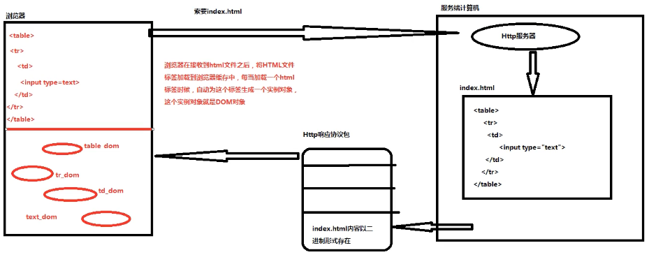

🙋 当浏览器接收到html文件后，将html文件标签加载到浏览器的缓存中，每当加载一个html标签，则会为这个标签自动生成一个实例对象，该实例对象就是dom对象

🙋 生命周期：

* 浏览器关闭之前或浏览器请求其他资源文件之前，本次生成的DOM对象一直存活在浏览器的缓存中
* 浏览器关闭时，浏览器缓存中DOM对象将要被销毁
* 浏览器请求到新的资源文件后，浏览器缓存中原有的DOM对象将会被覆盖

### document对象

> 文档对象 —— document对象
>
> * 用于在浏览器内存中根据定位条件定位DOM对象

#### document对象生命周期

* 在浏览器将网页中所有的标签加载完毕后，在内存中将使用【树形结构】来存储这些DOM对象。在树形结构生成完毕后由浏览器生成一个document对象，管理这棵树（DOM树）

  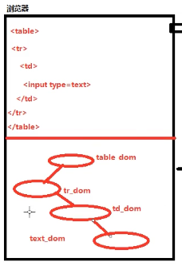

  **在浏览器接收网页中标签加载完毕后，自动在浏览器内存生成一个document对象**

* 浏览器运行期间，只会生成一个document对象

  * 一个HTML文件对应一个document对象

* 在浏览器关闭时，负责将document对象进行销毁

#### 通过document对象定位DOM对象的方式

##### 根据HTML标签的id树形定位DOM对象

命令格式 —— var domObj = document.getElementById("id属性值");

通知document对象定位id属性等于one的标签关联的DOM对象

##### 根据HTML标签的name属性值定位DOM对象

命令格式 —— var domArray = document.getElementByName("name属性值");

通知document对象将所有name属性等于deptNo的标签关联的DOM对象进行定位并封装到一个数组进行返回。domArray就是一个数组，存放本次返回的所有dom对象。

##### 根据HTML标签类型定位DOM对象

命令格式 —— var domArray = document.getElementsByTagName("标签类型名");

通知document对象将所有段落标签关联的dom对象进行定位并封装到一个数组返回

----

### 浏览器缓存

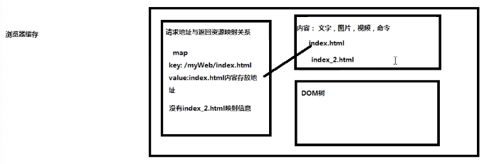

* get方式会在浏览器缓存，post方式禁止缓存

----

### DOM对象对HTML标签属性操作

#### DOM对象对标签value属性进行取值与赋值操作

```javascript
<!--取值操作-->
  var domObj = document.getElementById("one");
	var num = domObj.value;
<!--赋值操作-->
  var donObj = document.getElementById("one");
	domObj.value = "abc";
```

#### DOM对象对标签中【样式属性】进行取值与赋值操作

```javascript
<!--取值操作-->
	var domObj = document.getElementById("one");
	//读取当前标签【背景颜色属性】值
	var color = domObj.style.背景颜色属性
<!--赋值操作-->
	var domObj = document.getElementById("one");
	//通过DOM对象对标签中的【背景颜色属性】进行赋值
	domObj.style.背景颜色属性 = 值;
```

#### DOM对象对标签中【状态属性】进行取值与赋值操作

```javascript
//状态属性都是boolean类型
disabled = true;	//表示当前的标签不可以使用
disabled = false; //表示当前标签可以使用

checked: 只存在于radio标签与checkbox标签
checked = true;	  //表示当前标签被选中了
checked = false;	//表示当前标签未被选中

//取值操作
var domObj = document.getElementById("one");
var num = domObj.checked;
//赋值操作
var domObj = document.getElementById("one");
domObj.checked = true;
```

#### DOM对象对标签中【文字显示内容】进行赋值与取值

```javascript
//文字显示内容：只存在于双目标签之间 <tr>100</tr>
//取值操作：
	var domObj = document.getElementById("one");
	var num1 = domObj.innerText;
//赋值操作：
	var domObj = document.getElementById("one");
	domObj.innerText = 值;
```

🙋 innerText与innerHTML区别：

* innerText与innerHTML都可以对标签文字显示内容进行赋值与取值
* innerText只能接收字符串
* innerHTML既可以接收字符串，又可以接收HTML标签

----

### 监听事件

> 监听用户在何时以何种方式对当前标签进行操作
>
> 当监听到相关行为时，通知浏览器调用对应JavaScript函数对当前用户请求进行处理

分类：

* 监听用户使用键盘操作当前标签
* 监听用户使用鼠标操作当前标签

监听用户何时使用鼠标操作当前标签：

1. onclick：监听单击
2. onmouseover：监听用户何时将鼠标悬停在当前标签
3. onmouseout：监听用户何时将鼠标从当前目标离开
4. onfocus：监听用户何时通过鼠标让当前标签获得光标
5. onblur：监听用户何时通过鼠标让当前标签丢失光标

监听用户何时使用键盘操作当前标签：

1. onkeydown：监听用户何时在当前标签上按下键盘
2. onkeyup：监听用户何时在当前标签上弹起键盘

----

### onload监听事件

> 作用 —— 监听浏览器何时将网页中HTML标签加载完毕

浏览器每加载一个HTML标签时，自动在内存生成一个DOM对象，在浏览器将网页所有标签加载完毕时，意味着当前网页中所有标签都生成对应的DOM对象。onload此时就可以出发调用函数对浏览器中标签进行处理，此时不会出现未找到DOM对象的问题。

案例：


🙋 运行后并没有跳出提示。

原因：浏览器在运行的过程中，对于命令的执行是自上而下进行的。导致还没有运行body内的代码时就已经索要domObj了，而此时dom为null

为了解决该问题，可以使用onload监听事件

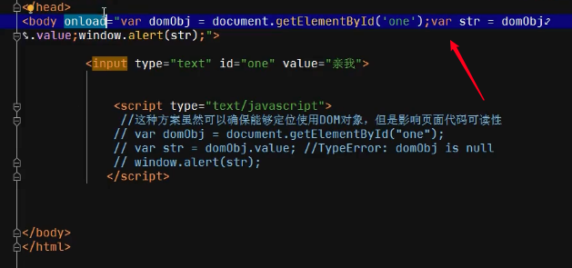

优化版：

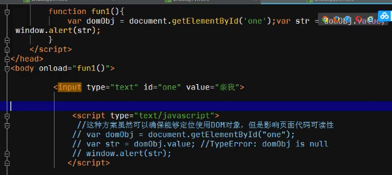

```javascript
<script type = "text/javascript">
  function fun1(){
  	window.alert("fun1 is run..");
	}
</script>
<body onload="fun1()">
</body>
```

---

### 基于DOM对象实现监听事件与HTML标签之间绑定

> 前提：实际开发过程中，同一个监听事件往往与多一个HTML标签进行绑定，这样增加了开发难度，在未来维护过程中也增加了维护难度 ——> 我们希望能够通过简单的方式将一个监听事件与大量的HTML标签实现绑定

实现的命令形式：

```javascript
domObj.监听事件名 = 处理函数名
//此处处理函数名后面不能出现()
```

举例：

```javascript
var donObj = document.getElementById("one");
domObj.oneclick = fun1;	//注意函数名后面不能有()
//相当于
<input type = "button" id = "one" onclick = "fun1()">
```

```javascript
function fun1(){
	this.style.backgrundColor="blue";
}
function fun2(){
	this.style.backgroundColor="white";
}

function main(){
	var domArray = document.getElementsByTagName("tr");
	for(var i=1; i<domArray.length; i++){
		var trDom = domArray[i];
		trDom.onmouseover = fun1;
		trDom.onmouseout = fun2;
	}
}

...

<body onload="main()">
```

---

## 高级内容

### arguments属性

1. JavaScript中，每一个函数都包含一个arguments属性
2. arguments属性是一个数组
3. 在函数调用时，将实参出入到函数的arguments中，再由arguments将数据传递给形参
4. arguments属性存在，可以将JavaScript中函数在调用时传递实参与形参格式，增加函数调用灵活性
5. arguments属性只能在函数体内使用，不能在函数体外使用

🙋 JavaScript中函数重载：当一个函数接收到不同参数时，能提供不同的功能

当fun3接收到一个string类型实参，执行say hello；接收到两个number类型实参，执行加法运算

```javascript
function fun3(){
	if(arugments.length==1 && typeof arguments[0]=='string'){
		window.alert("Hello" + arguments[0])
	}else if(arguments.length==2 && typeof arguments[0]=='number'&&typeof arguments[1]=='number'){
		var num3 = arguments[0] + arguments[1];
		window.alert("数字" + arguments[0] + "+" + arguments[1] + "=" num3)
	}
}
```


### function类型对象

> function是JavaScript中一种高级数据类型
>
> 一个function类型对象用于管理一个具体函数
>
> JavaScript中funciton类型相当于Java中Method类型

function类型对象的声明方式：

1. 标准声明方式

   ```JavaScript
   function 函数对象名(参数1，参数2){
   	命令;
   }
   ```

   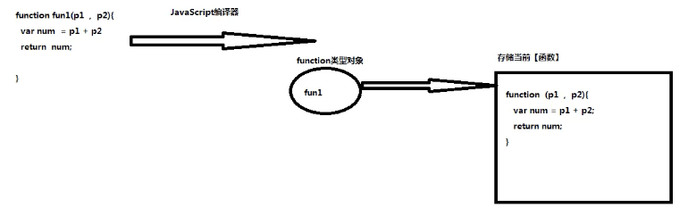

2. 匿名声明方式

   ```javascript
   var fun2 = function(参数1，参数2){命令1，命令2}
   ```

function对象的创建时机

浏览器在加载<script>时，共加载两次

第一次加载，将<script>标签所有**以标准形式声明函数对象**进行创建

第二次加载，将<script>标签所有命令行按照**自上而下**的顺序执行

* 匿名声明方式被视为命令行

```javascript
<script>
  fun2;	//调用失败
	var fun2 = function(){ window.alert("fun2 is run...")};
	//下方调用
	fun2();	//调用成功
</script>
```


### 局部变量与全局变量

1. 局部变量

   > 在函数执行体内，通过var修饰符声明的变量

   ```javascript
   function fun1(){
   	var name = "mike";	//局部变量
   }
   ```

   🙋 局部变量只能**在当前函数执行体使用，不能在函数执行体外使用**

2. 全局变量

   > 全局变量可以再当前HTML文件中所有的函数中使用
   >
   > 当全局变量被声明时，自动分配给window对象作为其属性

   声明方式：

   (1) 直接在script标签下，通过var声明的变量，就是全局变量

   ```javascript
   <script>
   	//全局变量，此时等同于window.name = "mike";
   	var name = "mike";
   	var age = 23;
   	
   	function fun1(){
   		window.alert("hello" + name);
   	}
   	
   	function fun2(){
   		window.alert("bye" + name);
   	}
   	
   	window.alert(window.name);
   	window.alert(window.age);
   </script>
   ```

   (2) 在函数执行体内，没有通过var修饰符修饰的变量也是全局变量

   ```javascript
   function fun3(){
   	var sex = "male";	//sex属于局部变量
   	home = "辽宁";		//home属于全局变量，【当这行命令执行时】相当于window.home = "辽宁"
   	window.alert(window.home);	//undefined
   	window.alert(window.home);	//“辽宁”
   }
   ```


### Object类型对象特征

> 在JavaScript中，所有通过【构造函数】生成对象其数据类型都是object类型

🙋 object类型对象在创建完毕后，可以根据实际情况，任意添加属性和方法，也可以移除属性和方法

属性维护：

1. 第一种维护方法：

   添加属性：

   ​	object对象.新属性名 = 值;

   添加函数：

   ​	object对象.新函数对象名 = function(){};

   ```javascript
   <script type = "text/javascript">
   	var obj1 = new Object();
   	//新增属性
   	obj1.sid = 10;
   	obj1.sname = "mike";
   	//新增函数
   	obj1.sayHello = function (param){ window.alert(name + "向" + param + "问号")}
   </script>
   ```

   

2. 第二种维护方法：

   添加属性：

   ​	object对象["新属性名"] = 值;

   添加函数：

   ​	obejct对象["新函数对象名"] = function;

   ```javascript
   var obj2 = new Object();
   obj2["deptNo"] = 20;
   window.alert("obj2.deptNo" + obj2.deptNo);
   //特别用途，将变量的值作为属性名保存
   var departName = "dname";
   obj2[departName] = "Operation";
   window.alert("obj2.dname = " + obj2.dname);
   
   //移除dname属性
   delete obj2.dname;
   ```

🙋 快捷开发，但是维护难


### 自定义构造函数

```javascript
function 函数对象名(){
	...
}
```

调用：

```javascript
var object类型对象名 = new 函数对象名();
```

普通函数与构造函数区分：

1. 函数没有调用之前，无法区分函数身份，只能根据函数调用形式区分
2. 判断普通函数：var num = 函数对象名();
3. 判断构造函数：var num = new 函数对象名();
4. 返回值：
   * 普通函数运行后需要通过return将执行结果返回
   * 构造函数运行后，直接返回一个object类型对象，**此时函数return相当于无效**


### this指向问题

首先谈java中的this：

```javascript
public class Student(){
	private String sname;
	public Student(){
		this.sname = "mike";	//指向由构造方法生成的实例对象
	}
	public void sayHello(){
		//this，调用sayHello方法的实例对象
	}
}
```

🙋 JavaScript中this指向与Java中this指向完全一致

1. 在构造函数中，this指向当前构造函数生成object类型对象
2. 在普通函数中，this指向调用当前函数的实例对象

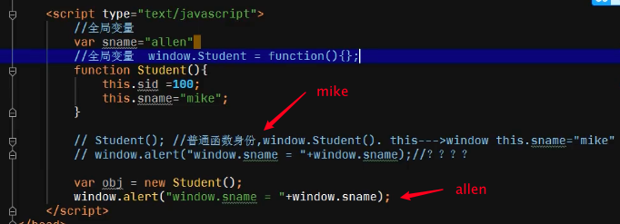

```javascript
<script>
        /*
         * 在JavaScript中模拟HashMap类型对象
         * 要求具有put&get功能
         */

        function HashMap(){
            var obj1 = new Object();
            this.put = function (key,value) {
                obj1[key] = value;
            }
            this.get = function (key) {
                return obj1[key];
            }
        }

        var map = new HashMap();
        map.put("key1","100");
        map.put("key2","200");
        var num = map.get("key1");
        window.alert("num = " + num);
</script>
```


### JSON

1. JavaScript中得到object类型对象的方式有以下几种：

* 方式1：由构造函数生成的对象都是obejct类型对象
* 方式2：由Json数据描述格式生成的对象都是object类型对象

2. JSON数据描述格式：

* JavaScript中获得object类型对象简化版

3. 标准命令格式：

```javascript
var obj = {"属性名1":值,"属性名2":值};
```

🙋 开发人员习惯于将由JSON生成object类型对象称为【JSON对象】

```javascript
<script>
	var stuObj = {"sid":1,
								"sname":"mike",
								"study":function(){window.alert("good study")}};
	window.alert(stuObj.sname);
	stuObj.study();
</script>

//JSOPN最简单的使用方式
var obj = {};
```

4. JSON数组

   专门存放JSON对象的数组被称为JSON数组

   ```javascript
   <script>
   	//存放多个城市对象（cityId，cityName）
   	var jsonArray = [
   		{"cityId":1,"cityName":"Beijing"},
   		{"cityId":2,"cityName":"Shanghai"},
   		{"cityId":3,"cityName":"Guangzhou"}
   	]
   	for(var i = 0; i < jsonArray.length; i++){
   		var cityObj = jsonArray[i];
   		window.alert(cityObj.cityName);
   	}
   	//快速创建一个空的obeject对象
   	var obj = {};
   </script>
   ```

#### Json实现服务端与JavaScript之间的通信

若使用EL从request作用域对象获得服务端的学生类

```javascript
var stuObj = ${requestScope.key};
```

在浏览器的console中则会发现报错：

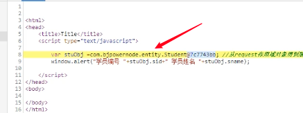

🙋 因为通过EL所传输的值为对象的引用地址，利用该方法，采用以下形式：

```java
//selvet端
//Student stu = new Student(10,"mike");
String stu = "{\"sid\":10,\"sname\":\"mike\"}";
request.setAttribute("key",stu);
//请求转发，向tomcat申请调用index_1.jsp，并将request和response通过tomcat交给index_1.jsp
request.getRequestDispatcher(/index_1.jsp).forward(request,response);

```

结果：

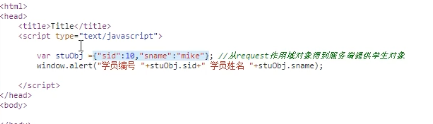


#### 通过反射机制将Java高级类型对象内容转换为Json格式

```java
import java.lang.reflect.Field;

public class ReflectUtil {
    //作用：将任意类型对象内容转换为Json格式字符串返回
    //参数：一个高级引用类型对象 Student对象，Dept对象，....
    public String jsonObject(Object obj){
        //1.获得当前对象隶属的【class】文件
        Class classFile = null;
        Field fieldArray[] = null;
        classFile = obj.getClass();     //Student.class
        StringBuffer str = new StringBuffer("{");
        //2.获得【class文件】所有【属性】
        fieldArray = classFile.getDeclaredFields();
        //3.获得当前对象 所有属性的值
        try{
            for(int i = 0; i < fieldArray.length; i++){
                Field field = fieldArray[i];
                field.setAccessible(true);  //确保私有访问权限属性可以再class文件外部使用
                String fieldName = field.getName(); //获得属性名称
                Object value = field.get(obj);
                //4.将获得属性及其值拼接为JSON格式字符串
                str.append("\"");
                str.append(fieldName);
                str.append("\":");
                str.append("\"");
                str.append(value);
                str.append("\"");
                if(i < fieldArray.length-1){
                    str.append(",");
                }
            }
        }catch(Exception e){
            e.printStackTrace();
        }finally {
            str.append("}");
        }
        return str.toString();
    }
}
```

---

#### JSON包的使用介绍

JSON包一共包含了6个jar包，互相嵌套缺一不可：

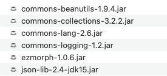

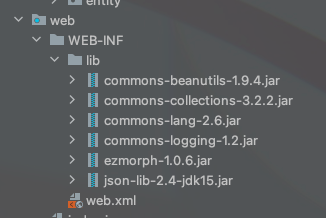

简单使用：

```java
//servlet接口实现类
@WebServlet(name = "oneServlet", value = "/oneServlet")
public class oneServlet extends HttpServlet {
    @Override
    protected void doGet(HttpServletRequest request, HttpServletResponse response) throws ServletException, IOException {
        //1.得到一个部门类型对象
        Dept dept = new Dept(10,"人寿社保");

        //2.通过json.jar中工具类将Dept对象中内容转换为JSON格式字符串
        JSONObject jsonObj = JSONObject.fromObject(dept);

        //3.将JSON格式字符串添加到请求作用域对象
        request.setAttribute("key1",jsonObj.toString());
        request.getRequestDispatcher("/index_1.jsp").forward(request,response);
    }
}
```

```javascript
//通过jsp获得servlet请求转发得到的请求与响应对象，获得其中的数据
<%@ page contentType="text/html;charset=UTF-8" language="java" %>
<html>
<head>
    <title>Title</title>
    <script>
        function init(){
            var deptObj = ${requestScope.key};
            document.getElementById("deptNo") = deptObj.deptNo;
            document.getElementById("dname") = deptObj.dname;
        }
    </script>
</head>
<body onload="init()">
```

数组形式：

```java
@WebServlet(name = "twoServlet", value = "/twoServlet")
public class twoServlet extends HttpServlet {
    @Override
    protected void doGet(HttpServletRequest request, HttpServletResponse response) throws ServletException, IOException {
        Dept dept1 = new Dept(10,"nullName1");
        Dept dept2 = new Dept(20,"nullName2");

        List deptList = new ArrayList();

        deptList.add(dept1);
        deptList.add(dept2);

        //2. 通过JSON.jar工具类将集合内容转换为json数组格式字符串
        JSONArray jsonArray = JSONArray.fromObject(deptList);

        //3. 将JSON数组格式字符串添加到请求作用域对象
        request.setAttribute("key2",jsonArray.toString());

        //4. 请求转发
        request.getRequestDispatcher("/index_2.jsp").forward(request,response);
    }
}
```

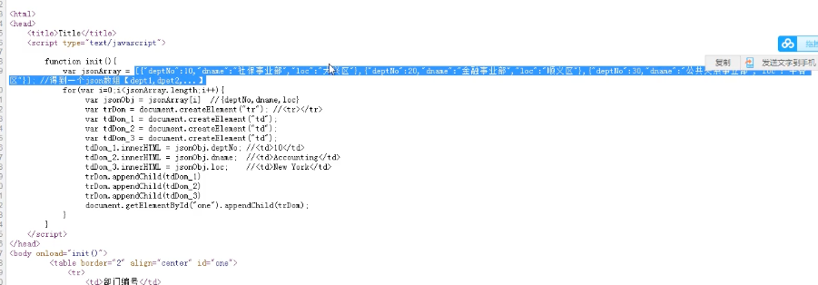


