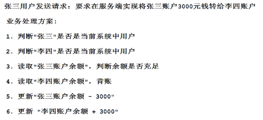
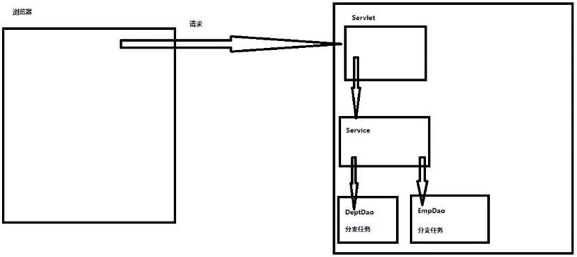
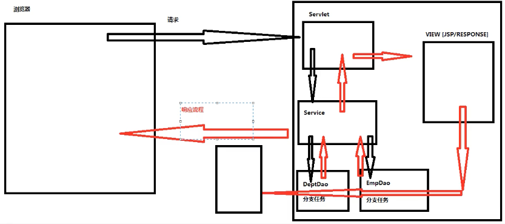

# MVC开发规则

---

> MVC开发规则制定了互联网通信开发过程中以下的规则：
>
> 1. 必须出现的角色有哪些
> 2. 必须出现的角色担负哪些责任
> 3. 必须出现的角色其出场顺序

---

## 角色

1. DAO对象 —— 提供某张表文件的操作细节，降低对表文件操作难度，避免反复开发表文件操作的代码，提高代码的复用性（对部门表添加，直接调用DAO）
2. Service对象 —— 服务对象，提供【业务】的具体解决方案
   * Service对象的一个方法指定一个业务的解决方案，避免业务开发重复性开发行为，提高复用性
   * 网站中每一个业务都有一个独立标准解决方案

---

## 业务

* 浏览器向Http服务器发送的请求
* 用户向网站发送的请求

举例：

### 业务特征

> 真实业务场景中，一个业务往往包含了多个分支任务，因此解决业务开发工作量往往非常巨大
>
> 真实业务场景中，只有所有分支任务都能顺利成功解决，才可以认为当前业务处理成功

### 解决业务开发困扰

* 一个业务可能会在网站的多个地方重复出现，如果不做封装，会增加开发难度，造成重复性开发
* 不同程序员面对同一个业务时，给出解决方案往往也偏差，导致最终解决数据会有偏差

---

## MVC互联网通信开发过程中必须出现的角色

一次互联网开发过程中，必须出现的角色有以下三个：

| 角色 | 全称              | 习惯称呼                     | 实际开发过程中            |
| ---- | ----------------- | ---------------------------- | ------------------------- |
| C    | controller object | 控制层对象                   | servlet对象               |
| M    | model object      | 业务模型对象（Service 对象） | service对象               |
| V    | view object       | 视图层对象                   | jsp / HttpServletResponse |

---

## MVC互联网通信开发过程中必须出现的角色所担负的职责

### C（servlet对象）

1. 【可以】调用【请求对象】读取【请求包】参数信息
2. 【必须】调用【Service对象】处理业务
3. 【必须】调用【视图层对象】将结果写入到响应体

### M（Service对象）

1. 处理业务中所有分支任务
2. 根据分支任务执行情况判断业务是否处理成功
3. 必须通过return将处理结果返回给【控制层对象】

### V（jsp/HttpServletResponse）

1. 【禁止参与业务处理】
2. 唯一任务将处理结果写入到响应体

---

## MVC互联网通信开发过程中必须出现的角色其出场顺序

请求调用顺序：

浏览器 --- 发送请求 ---> Servlet ---> Service ---> 不同的Dao

响应顺序：

不同的Dao --- 分支任务结果 ---> Service ---> Servelt ---> View ---> 响应体 --- tomcat ---> 浏览器

