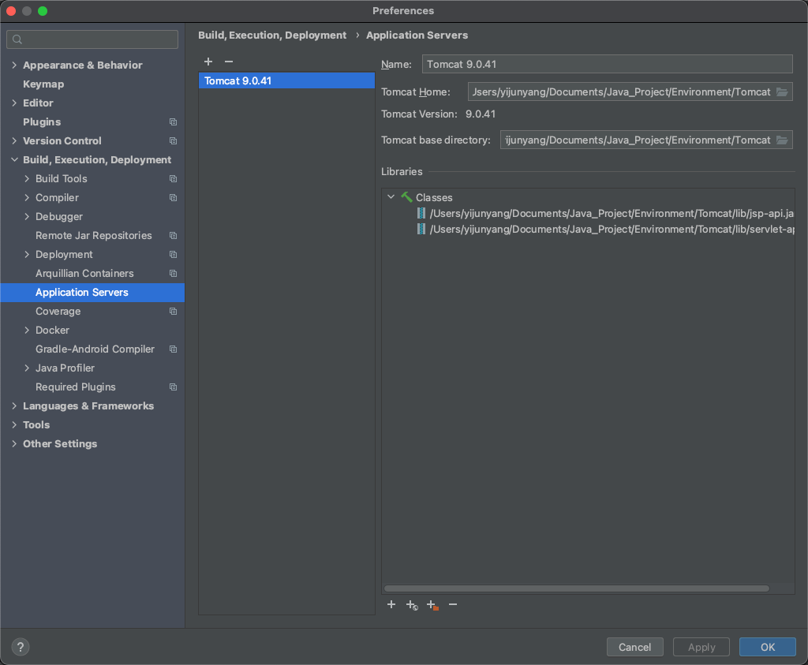
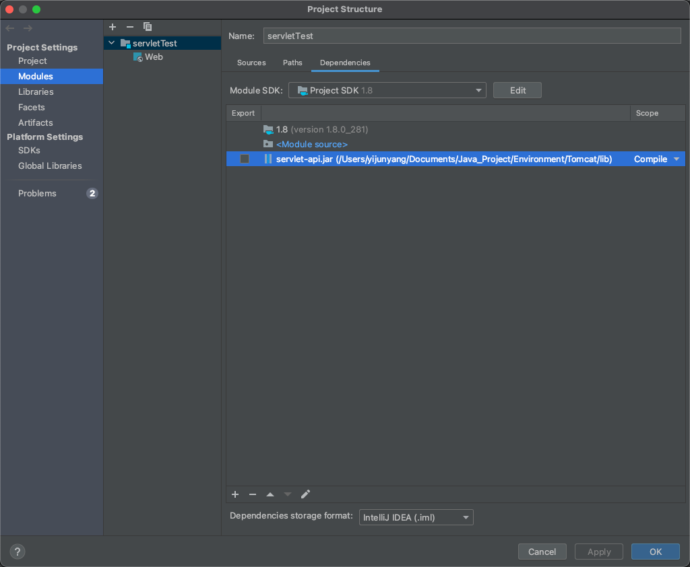
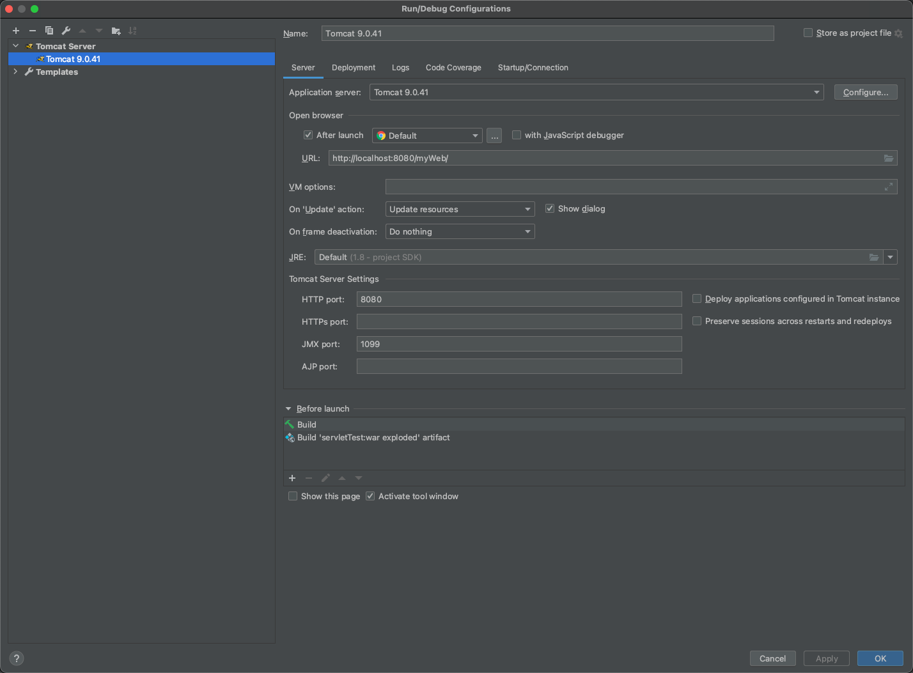
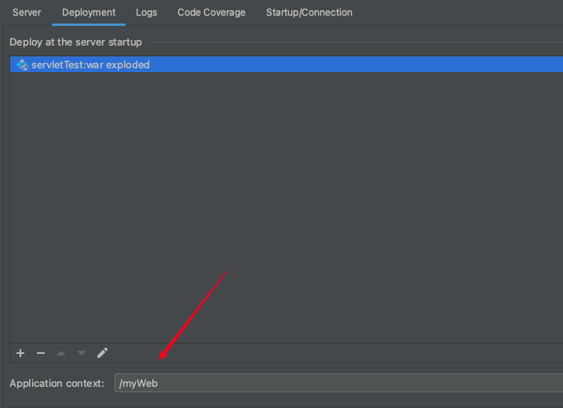

# 关于在MacOs上配置Tomcat

----

## 下载Tomcat

[Tomcat下载地址]: tomcat.apache.org

## 终端进入Tomcat

1. 通过Terminal进入Tomcat解压目录下的bin目录

2. 获取权限

   ```
   sudo chmod 755
   ```

3. 运行Tomcat测试

   ```
   sudo sh startup.sh
   ```

4. 网页端测试

   进入localhost下的8080

   http://localhost:8080/

   🙋 若能看到Apache Tomcat，表示已经成功运行

5. 关闭Tomcat

   ```
   sudo sh shutdown.sh
   ```

## IDEA代理Tomcat

### 在Perferences中加入Local Tomcat

### 在Project structure中导入servlet.jar



在Run-Run/Debug configurations中设置Tomcat服务器



在Deplotment中设置网站目录地址



其他设置按照Servlet的web.xml进行

