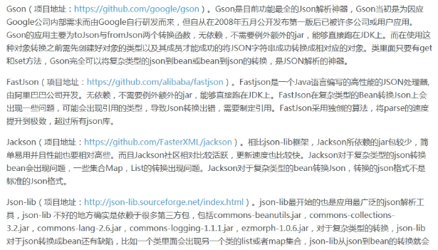
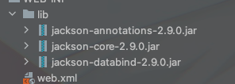
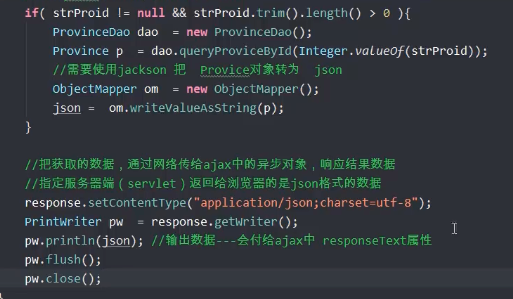
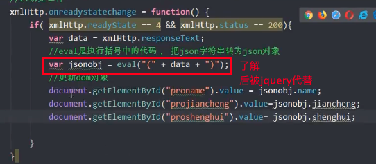

# Ajax

---

## 全局刷新与局部刷新

* 全局刷新 —— 整个浏览器被新的数据覆盖。在网络中国传输大量的数据，浏览器需要重新加载，渲染页面。
* 局部刷新 —— 在浏览器内部，发起请求，获取数据，改变页面中的部分内容。其余页面无需加载预渲染，网络中数据传输量少，给用户的感受好。

🙋 Ajax是用来做局部刷新的工具。局部刷新使用的核心对象是【异步对象】（XMLHttpRequest）这个异步对象是存在浏览器内存中的，使用javascript语法创建和使用XMLHttpRequest对象

---

## Ajax简介

> AJAX —— Asynchronous JavaScript and XML（异步的JavaScript和XML）
>
> AJAX是一种在无需重新加载整个网页情况下，能够更新部分页面内容的新方法。
>
> Ajax不是一种语言，其所包含的技术主要有JavaScript，dom，CSS，XML等等。核心是JavaScript和XML
>
> * JavaScript —— 否则创建异步对象，发送请求，更新页面的dom对象。
>   * Ajax请求需要服务器端的数据
> * XML —— 网络中传输的数据格式，使用了json替换了xml
>   * <data>
>     * <data1>宝马1</data1>
>     * <data2>宝马2</data2>
>   * </data>

---

## Ajax异步实现步骤

在Ajax中使用XMLHttpRequest对象：

（1）创建异步对象

```javascript
var xmlHttp = new XMLHttpRequest();
```

（2）给异步对象绑定事件

**onreadystatechange**：当异步对象发起请求，获取了数据都会触发这个事件。

这个事件需要指定一个函数，在函数中处理状态的变化。

```javascript
Btn.onclick = fun1()
function fun1(){
	alert("按钮单击")
}
```

```javascript
//For example
xmlHttp.onreadystatechange = function(){
	处理请求状态的变化。
  if(xmlHttp.readyState == 4 && xmlHttp.status == 200){
    //可以处理服务器端的数据，更新当前页面
  }
}
```

**异步对象的属性 —— readyState**

> 异步对象请求的状态变化

| 属性 | 所表示的状态                                                 | 具体代码              |
| ---- | ------------------------------------------------------------ | --------------------- |
| 0    | 创建异步对象时                                               | new XMLHttpRequest(); |
| 1    | 初始异步请求对象                                             | xmlHttp.open()        |
| 2    | 发送请求                                                     | xmlHttp.send()        |
| 3    | 从服务器端获取了数据，注意3是异步对象内部使用，获取了原始的数据 |                       |
| 4    | 异步对象把接收的数据处理完成后。<br />此时开发人员在4的时候处理数据。在4的时候，开发人员做什么？更新当前页面。 |                       |

**异步对象的属性 —— status**

> 表示网络请求的状况
>
> * 200，404，500
> * 需要当status==200时，表示网络请求是成功的

## 初始异步请求对象

异步的方法open()

```javascript
xmlHttp.open(请求方式get|post, "服务器端的访问地址", 同步|异步请求(默认是true，表异步请求))
```

```javascript
//例如
xmlHttp.open("get","loginServlet?name=zs&pwd=123",true);
```

## 使用异步对象发送请求

发送方法send()

```
xmlHttp.send()
```

获取服务器端返回的数据，使用异步对象的属性responseText

```javascript
//使用例子
xmlHttp.responseText
```

🙋 回调：当请求的状态发生变化时，异步对象会自动调用onreadystatechange**事件对应的函数**

---

## 简单实践

使用ajax实现局部刷新：

1. 新建jsp，使用XMLHttpRequest异步对象（使用异步对象的四个步骤）
   1. 创建
   2. 绑定事件
   3. 初始请求
   4. 发送请求
   
   ```javascript
   <script type="text/javascript">
   	//使用内存中的异步对象，代替浏览器发起请求，异步对象使用js创建和管理
     function doAjax(){
     //1.创建异步对象
     var xmlHttp = new XMLHttpRequest();
     //2.绑定事件
     xmlHttp.onreadystatechange = function (){
       //处理服务器端返回的数据，更新当前页面
       //alert("readyState属性值为：" + xmlHttp.readyState);
       if(xmlHttp.readyState == 4 && xmlHttp.status == 200){
         alert(xmlHttp.responseText);
       }
     }
     //3.初始请求输出
     xmlHttp.open("get","bmiAjax",true);
     //4.发起请求
     xmlHttp.send();
   }
   </script>
   ```
   
2. 创建服务器的servlet，接收并处理数据，把数据输出给异步对象

```html
<!--完整过程-->
<!--jsp端-->
<%@ page contentType="text/html;charset=UTF-8" language="java" %>
<html>
  <head>
    <title>局部刷新</title>
    <script type="text/javascript">
      //使用内存中的异步对象，代替浏览器发起请求，异步对象使用js创建和管理
      function doAjax(){
        //1.创建异步对象
        var xmlHttp = new XMLHttpRequest();
        //2.绑定事件
        xmlHttp.onreadystatechange = function (){
          //处理服务器端返回的数据，更新当前页面
          //alert("readyState属性值为：" + xmlHttp.readyState);
          if(xmlHttp.readyState == 4 && xmlHttp.status == 200){
            //从服务器端拿回的数据
            alert(xmlHttp.responseText);
          }
        }
        //3.初始请求输出
        //获取dom对象的value属性值
        var sName = document.getElementById("name").value;
        var weight = document.getElementById("w").value;
        var height = document.getElementById("h").value;

        var msg = "name=" + sName + "&w=" + weight + "&h=" + height;
				//测试字符串拼接情况，最终效果为name=tim&w=58&h=1.78
        alert(msg);
        //服务器端的访问地址并携带参数
        //bmiAjax?name=tim&w=58&h=1.78
        xmlHttp.open("get","bmiAjax?" + msg,true);
        //4.发起请求
        xmlHttp.send();
      }
    </script>
  </head>
  <body onload="doAjax()">
    <p>局部刷新计算bmi</p>
    <div>
      <!-- 没有使用form -->
      姓名：<input type = "text" id = "name"><br/>
      体重(kg):<input type = "text" id = "w"><br/>
      身高(m):<input type = "text" id = "h"><br/>
      <input type="submit" value="提交" onclick="doAjax()">
    </div>
  </form>
  </body>
</html>
```

```java
//Servlet端
@WebServlet(name = "bmiAjaxServlet", value = "/bmiAjaxServlet")
public class bmiAjaxServlet extends HttpServlet {
    @Override
    protected void doGet(HttpServletRequest request, HttpServletResponse response) throws ServletException, IOException {

        //接收请求参数
        String name = request.getParameter("name");
        String height = request.getParameter("h");
        String weight = request.getParameter("w");

        //计算bmi：bmi = 体重/身高的平方
        float h = Float.valueOf(height);
        float w = Float.valueOf(weight);
        float bmi = w / (h * h);

        //判断bmi的范围
        String msg = "";
        if(bmi < 18.5){
            msg = "您比较瘦";
        }else if( bmi > 18.5 && bmi <= 23.9){
            msg = "你的bmi是正常的";
        }else if( bmi > 24 && bmi <= 27){
            msg = "您比较胖了";
        }else if( bmi > 28 && bmi <= 32){
            msg = "您好胖";
        }else{
            msg = "你也太胖了";
        }

        msg = "您好，"+name+"先生/女士，您的bmi值为："+bmi+","+msg;

        System.out.println("success");
        response.setContentType("text/html;charset=utf-8");
        PrintWriter pw = response.getWriter();
        pw.println(msg);
        pw.flush();
        pw.close();
    }
}
```

---

## 利用JSON返回数据

ajax发起请求 ---> servlet（返回一个json格式的字符串{name:"河北",jiancheng:"冀","shenghui":"石家庄"}）

**json分类**

1. json对象，JSONObject —— 这种对象的格式 —— 名称：值
2. json数组，JSONArray，其中包含了JSON对象，基本格式 [{...},{...}]

**为什么使用json**

1. 好理解

2. 在多种语言中，比较容易处理

   在java、javascript读写json格式的数据比较容易

3. json格式数据占用的空间小，在网络中传输快，用户体验好

**常用的各种json工具包**



* gson —— google
* fastjson —— ali
* jackson
* json-lib

🙋 在js中，可以把json格式的字符串，转为json对象，json中的key，就是json对象的属性名

### Jackson包的使用

Jackson包包含以下3个jar包：



重要代码：

```java
ObjectMapper om = new ObjectMapper();
String json = om.writeValueAsString(p);	//p为object（实体类）
```

For example：

```java
//省略Province实体类的代码
public class TestJson {
    public static void main(String[] args) throws Exception{
        Province p = new Province();
        p.setId(1);
        p.setName("Shanghai");
        p.setJIANCHENG("hu");
        p.setShenghui("Shanghai");

        //使用jason将p转化为json
        ObjectMapper om = new ObjectMapper();
        String json = om.writeValueAsString(p);
        System.out.println(json);
    }
}
```

实际Servlet代码：



🙋 主要setContentType方法中为“application/json;charset=utf-8”



---

## 异步与同步

```javascript
xmlHttp.open(请求方式get|post, "服务器端的访问地址", 同步|异步请求(默认是true，表异步请求))
//以上代码中，第三个参数同步or异步请求是什么功能？
```

异步表示的是不需要等到servlet返回数据，就可以继续处理send函数之后的其他内容

* true：异步处理请求。使用异步对象发起请求后，不用等待数据处理完毕，就可以执行其他操作
* false：同步，异步对象必须处理完成请求，从服务器端获取数据后，才能执行send之后的代码。任意时刻只能执行一个异步请求。


