# jQuery

---

> jQuery是一款跨主流浏览器的JavaScript库，封装了JavaScript相关方法调用，简化了JavaScript对HTML DOM的操作

1. 可兼容市面上主流的浏览器
2. 写少代码，做多事情
3. 免费，开源且轻量级的js库
4. 能够处理html/JSP/XML、CSS、DOM、事件、实现动画效果，也能提供异步AJAX功能
5. 成熟的插件可选择
6. 不用在html中通过<script>标签插入一堆js调用命令了


---

## 介绍

### 第一次简单尝试

🙋 **注意注解的内容**

将jQuery的文件放到project下的js目录里

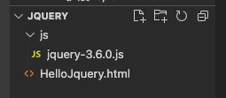

```html
<!DOCTYPE html>
<html lang="en">
<head>
    <meta charset="UTF-8">
    <meta http-equiv="X-UA-Compatible" content="IE=edge">
    <meta name="viewport" content="width=device-width, initial-scale=1.0">
    <title>First Example</title>
    <!--指定jquert库文件位置，使用相对路径-->
    <script type="text/javascript" src="js/jquery-3.6.0.js"></script>
    <script type="text/javascript">
    /*
        1.$(document): $是jQuery中函数的名称，而document是函数的参数，其作用为将ducument对象
            变成jQuery函数库可以使用的对象
        2.ready是jQuery中的函数，表示准备的意思，当页面中dom对象全部加载成功后，会执行ready函数
            的内容，ready相当于js中的onLoad事件
        3.function()自定义的表示onLoad后要执行的内容
    */
        $(document).ready(function(){
            //自定义的功能代码
            alert("Hello jQuery");
        })
    </script>
</head>
<body>
    
</body>
</html>
```

🙋 快速开发

```html
<!--jQuery快速开发-->
<!--与上方内容效果相同，平时开发多用该方法-->
<script>
  $(function(){
    ...	
    }
  )
</script>
```

☁️ $(document).ready()与$()、jQuery()、window.jQuery()是等价的

---

### Dom对象和jQuery对象

* dom对象 —— 使用javascript的语法创建的对象叫做dom对象，也就是js对象

  ```javascript
  var obj = document.getElementById("txt1");
  //obj是dom对象，也就是js对象
  obj.value
  ```

* jquery对象 —— 使用jquery语法表示的对象叫做jquery对象，注意：jquery表示的对象都是数组。

  ```javascript
  var jobj = $("#txt1")
  //jobj就是使用jquery语法表示的对象，也就是jquery对象，他是一个数组，现在数组中就一个值
  ```

**dom对象可以和jquery对象相互转换**

1. dom对象可以转为jquery

   ```
   $(dom对象)
   ```

2. jquery对象也可以转为dom对象

   从数组中获取的第一个对象，第一个对象就是dom对象，使用[0]或者get[0]

☁️ 为什么要进行dom和jquery的转换：目的是要使用对象的属性或者方法

```html
<script type="text/javascript" src="js/jquery-3.6.0.js"></script>
<script type="text/javascript">
function btnClick(){
  //获取dom对象
  var obj = document.getElementById("btn");
  //alert(obj.value);
  //把dom对象转为jquery，使用jquery库中的函数
  var jobj = $(obj);
  //调用jquery中的函数，获取value值
  alert(jobj.val());
}
</script>
```

举例 —— 获得数组下标第一位的jquery对象赋值给dom对象

```html
<!DOCTYPE html>
<html lang="en">
<head>
    <meta charset="UTF-8">
    <meta http-equiv="X-UA-Compatible" content="IE=edge">
    <meta name="viewport" content="width=device-width, initial-scale=1.0">
    <title>domToJqueryObject</title>

    <script type="text/javascript" src="js/jquery-3.6.0.js"></script>
    <script type="text/javascript">
        function btnClick(){
            //获取dom对象
            var obj = document.getElementById("btn");
            //alert(obj.value);
            //把dom对象转为jquery，使用jquery库中的函数
            var jobj = $(obj);
            //调用jquery中的函数，获取value值
            alert(jobj.val());
        }
        function btnClickCal(){
            //从数组中获取下标是0的dom对象
            var obj = $("#num")[0];
            alert(obj.value * obj.value);
        }
    </script>
</head>
<body>
    <input type="button" id="btn" value="按我计算平方啦" onclick="btnClickCal()"/>
    <input type="text" id="num"/>
</body>
</html>
```

----

## 选择器

> 是一个字符串，用来定位dom对象。
>
> 定位了dom对象，就可以通过jquery的函数操作dom

### **常用的选择器**

1. id选择器，语法：$("#dom对象的id值")

   通过dom对象的id定位dom对象。通过id找对象，id在当前页面中是唯一的。

2. class选择器，语法：$("class样式名")

   class表示css中的样式，使用样式的名称定位dom对象

3. 标签选择器，语法：$("标签名称")

   使用标签名称定位dom对象

4. 所有选择器，语法：$("*")

5. 组合选择器，语法：$("id选择器,class选择器,标签选择器")

```html
<script>
  function fun1(){
    //id选择器
    var obj = $("#one");
    //使用jquery中改变样式的函数
    obj.css("background","red");
  }
  function fun2(){
    //样式选择器
    var obj = $(".two");
    obj.css("background","yellow");
  }
  function fun3(){
    //标签选择器
    var obj = $("div");//数组有3个对象
    //jquery的操作都是操作数组中的全部成员
    //所以是给所有的div都设置背景色
    obj.css("background","blue");
  }
  function fun4(){
    var obj = $("*");
    obj.css("background","green");
  }
  function fun5(){
    var obj = $("#one,span");
    obj.css("background","red");
  }
</script>
```

---

### 表单选择器

> 表单相关元素选择器是指文本框、单选框、复选框、下拉列表等元素的选择方式，**该方法无论是否存在表单<form>，均可作出相应选择**。表单选择器是为了更加容易地操作表单，表单选择器是根据元素类型来定义的。
>
> 使用<input>标签的type属性，定位dom对象的方式

```html
<input type="button">
<input type="checkbox">
<input type="file">
<input type="hidden">
<input type="image">
<input type="password">
<input type="radio">
<input type="reset">
<input type="submit">
<input type="text">
```

语法：

```javascript
$(":type属性值")
```

For example:

```javascript
$(":text")				//选取所有的单行文本框
$(":password")		//选取所有的密码框
$(":radio")				//选取所有的单选框
$(":checkbox")		//选取所有的多选框
```

```html
		<script>      
			...
        function fun6(){
            //表单选择器$(":type值")
            var obj = $(":button");
            //获取value属性的值 val()是jquery中的函数
            alert(obj.val());
        }
    </script>
</head>
<body>
    <input type="button" id="btn" value="按我计算平方啦" onclick="fun6()"/>
</body>
</html>
```

数组的情况：

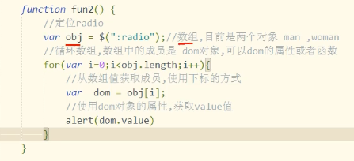

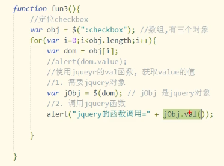

🙋 注意在使用的过程中究竟是dom对象还是jquery对象

---

## 过滤器

> 过滤器是过滤条件，对已经定位到数组中的dom对象进行过滤和筛选，过滤条件不能独立出现在jquery函数，如果使用只能出现在选择器的后方。

### 基本过滤器

1. 选择第一个first，保留数组中第一个dom对象

   ```javascript
   $("选择器:firts")
   ```

2. 选择最后一个last，保留数组中最后的dom对象

   ```javascript
   $("选择器:last")
   ```

3. 选择数组中指定的dom对象

   ```javascript
   $("选择器:eq(数组索引)")
   ```

4. 选择数组中小于指定索引的所有dom对象

   ```javascript
   $("选择器:lt(数组索引)")
   ```

5. 选择数组中大于指定索引的所有dom对象

   ```javascript
   $("选择器:gt(数组索引)")
   ```

### 表单属性过滤器

> 根据表单中dom对象的状态情况，定位dom对象

* 启用状态 —— enabled

  ```javascript
  $(":text:enabled")
  ```

* 不可用状态 —— disabled

  ```javascript
  $(":text:disabled")
  ```

* 选择状态 —— checked（如radio、checkbox）

  ```javascript
  $("checkbox:checked")
  ```

* 选择指定下拉列表的被选中元素

  ```javascript
  选择器>option:selected
  ```

  

例子：

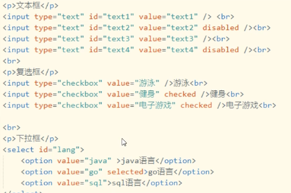


```javascript
<script type="text/javascript">
  $(function(){
  	$("#btn1").click(function(){
      //获取所有可以使用的text
      var obj = $(":text:enabled");
      obj.val("hello");
    })
  	$("#btn2").click(function(){
      var obj = $(":checkbox:checked");
      for(var i=0; i<obj.length; i++){
        alert(obj[i].value);
      }
    })
		$("#btn3").click(function(){
    	var obj = $("select>option:selected");
    	alert(obj.val());
  	})
    }
	})
</script>
```


---

## 函数

### 第一组

**val**

* 操作数组中dom对象的value属性

  ```javascript
  $(选择器).val()：无惨形式调用，读取数组中第一个dom对象的value属性值
  $(选择器).val(值)：有参形式调用；对数组中所有dom对象的value属性值进行统一赋值
  ```

**text**

* 操作数组中所有dom对象的【文字显示内容属性】

  ```javascript
  $(选择器).text():无参数调用，读取数组中所有dom对象的文字显示内容
  $(选择器).text(值):有参数方式，对数组中所有dom对象的文字显示内容进行统一赋值
  ```

**attr**

* 对val，text之外的其他属性操作

  ```javascript
  $(选择器).attr("属性名"):获取dom数组第一个对象的属性值
  $(选择器).attr("属性名","值"):对数组中所有dom对象的属性设为新值
  ```


### 第二组

**remove**

* 将数组中所有dom对象及其子对象一并删除

  ```javascript
  $(选择器).remove()
  ```

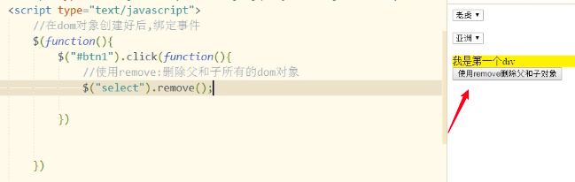

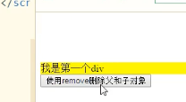

**empty**

* 将数组中所有dom对象的子对象删除

  ```javascript
  $(选择器).empty()
  ```

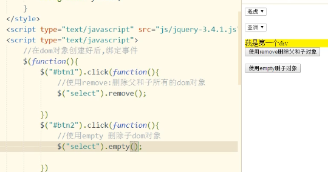

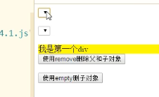

**append**

* 为数组中所有dom对象添加子对象

  ```javascript
  $(选择器).append("<div>我动态添加的div</div>")
  ```

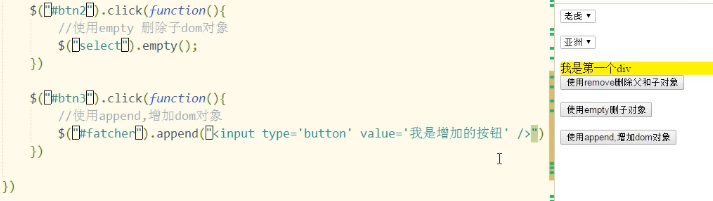

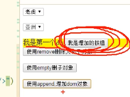

**html**

* 设置或返回被选元素的内容（innerHTML）

  ```javascript
  $(选择器).html():无参数调用方法，获取dom数组第一个元素的内容
  $(选择器).html(值)：有参数调用方法，用于设置dom数组中所有元素的内容
  ```

☁️ 使用text获取的内容，不会带有html标签

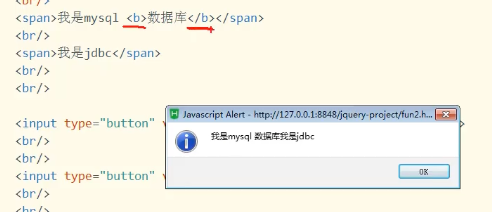

而html会包含其中的标签信息

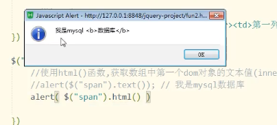

**each**

* each是对数组、json和dom数组等的遍历。数组、json中的每个成员都会调用一次处理函数。

  ```javascript
  $.each(要遍历的对象，function(index,element){处理程序})
  //$相当于java的一个类名
  //.each就是类中的静态方法
  //index,element都是自定义的形参，名称自定义
  //index：循环的索引
  //element：数组中的成员
  ```

  ```javascript
  //js中的循环数组
  for(var i=0; i<arr.length; i++){
  	var item = arr[i];//数组成员
  	//操作数组成员
  	shuchu(i,item);
  }
  //jQuery中each的参数function
  function shuchu(index,element){
  	输出index,element
  }
  //例子 —— 循环普通数组
  $("#btn").click(funciton(){
  	var arr = [1 , 2, 3];
  	$.each(arr, function(index,element){
  		alert("循环变量" + index + "===数组成员：" + element);
  	})
  })
  //例子 —— 循环json
  $("#btn").click(funciton(){
  	var json = {"name":"张三","age":20};
  	$.each(json, function(i,n){
  		alert("i是key==" + i + "n是值==：" + n);
  	})
  })
  //例子 —— 循环dom数组
  $().click(function(){
    var domArray = $(":text");	//dom数组
    $.each(domArray,function(i,n){
      //n是数组中的dom对象
      alert("i="+i+",n="+n.value);
    })
  })
  ```

* 循环jquery对象，jquery对象就是dom数组

  ```
  jquery对象.each(function(index,element){})
  ```

  ```javascript
  $("#btn").click(function(){
  	//循环jquery对象，jquery对象就是dom数组
  	$(":text").each(function(i,n){
  		alert("i="+i+",n="+n.value);
  	})
  })
  ```

  


---

## 事件

### 定义元素监听事件

```
$(选择器).事件名称(事件的处理函数)
```

* $(选择器):定位dom对象，dom对象可有多个，多个的情况下全部绑定事件

* 事件名称：js的事件中去掉on的部分，如onclick()去掉on后得到click()，则jquery中的事件名称即click，全部小写
* 事件的处理函数：即function，当事件发生时则执行函数的内容

```javascript
$("#btn").click(function(){
	alert("btn按钮被单击啦")
})
```

### on()绑定事件

on()方法在被选元素上添加事件处理程序。该方法给api带来许多便利，推荐使用。

```javascript
$(选择器).on(event,function)
//event：事件一个或者多个，多个之间空格分开；即js事件中去掉on的部分，如onclick-->click
//function：可选。规定当事件发生时运行的函数
$("#btn").on("click",function(){ 处理按钮单击 })
```

```javascript
$(function(){
	$(function(){
		$("#btn1").click(funtion(){
			$("#mydiv").append("<input id='newBtn' type='button' value='我是新增加的按钮'/>");
    	//给创建处理的dom对象增加事件
			$("#newBtn").on("click",function(){
				alert("新建的按钮被单击了");
			})
		})
	})
})
```


----

## AJAX

> 使用jquery的函数，实现ajax请求的处理
>
> 没有jquery之前，使用XMLHttpRequest做ajax，有4个步骤，jquery简化了ajax请求的处理
>
> 使用三个函数可以实现ajax请求的处理

```javascript
//jquery中实现ajax的核心函数
$.ajax() —— jquery中实现ajax的核心函数
$.post() —— 使用post方式做ajax琼求
$.get() —— 使用get方式发送ajax请求
//$.post()和$.get()在内部都是调用了$.ajax()
```

### $.ajax函数的使用

$.ajax()参数是一个json的结构

```javascript
$.ajax({名称:值，名称1：值1......})
//参数是json结构
```

参数：

* async：是一个boolean类型的值，默认是true，表示异步请求的。可以不写async这个配置项；**xmlHttp.open(get,url,true)，与第三个参数一样的意思。**

* contentType：一个字符串，表示从浏览器发送给服务器的参数的类型。可以不写。例如祥表示请求的参数是json格式的，可以写application/json

* data：可以是字符串，数组，json，表示请求的参数和参数值。常用的是json格式的数据。

* dataType：表示期望从服务器端返回的数据格式，可选的有：xml，html，text，json；当我们使用$.ajax()发送请求时，会把dataType的值发送给服务器，那我们的servlet能够读取到dataType的值，就知道你的浏览器需要的是json或者xml的数据，那么服务器就可以返回你需要的数据格式。

* error：一个function，表示当请求发生错误时，执行的函数。

  ```javascript
  error:function(){ 发生错误时执行 }
  ```

* success：一个function，请求成功了，从服务器返回了数据，会执行success指定的函数，之前使用XMLHttpRequest对象，当readyState==4&&status==200的时候。

* url：请求地址

* type：请求方式，get/post，不用区分大小写，默认是get方式

```javascript
//For example，主要使用的是url、data、dataType、success
$.ajax({async:true, 
        contentType:"application/json", 
        data:{name:"lisi",age:20}},
       	dataType:json,
       	error:function(){
  				请求发生错误时， 执行的函数},
        success:function(data){
          //data就是responseText，是jquery处理后的数据
        },
        url:请求的地址,
        type:"get"
          )
```


