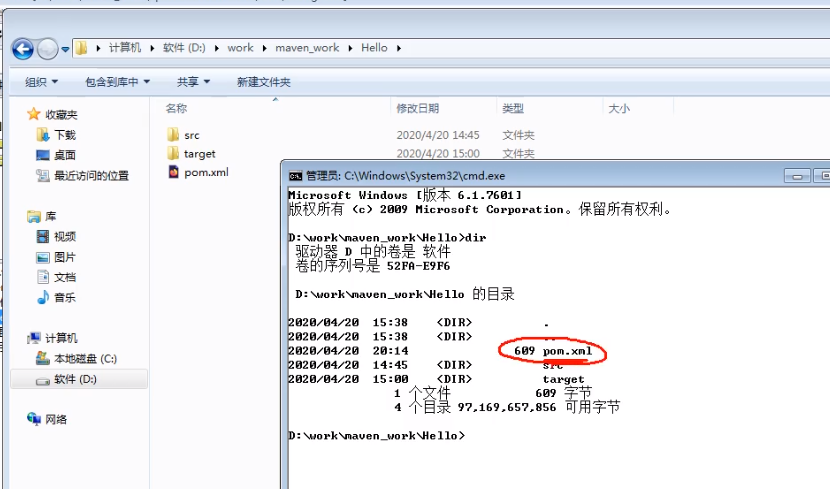
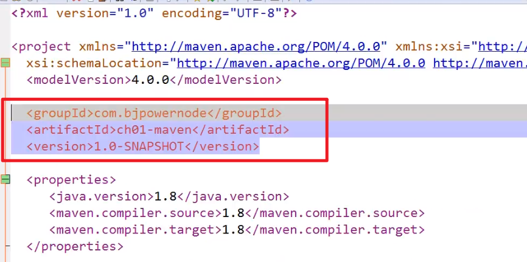
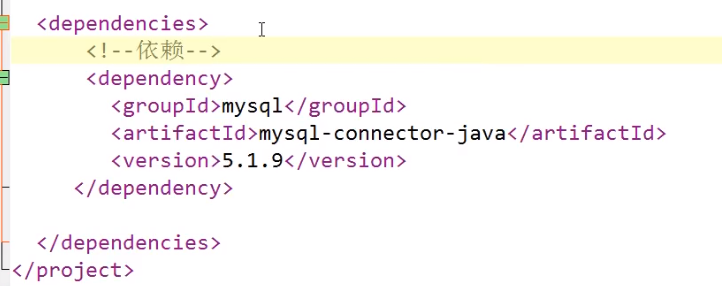
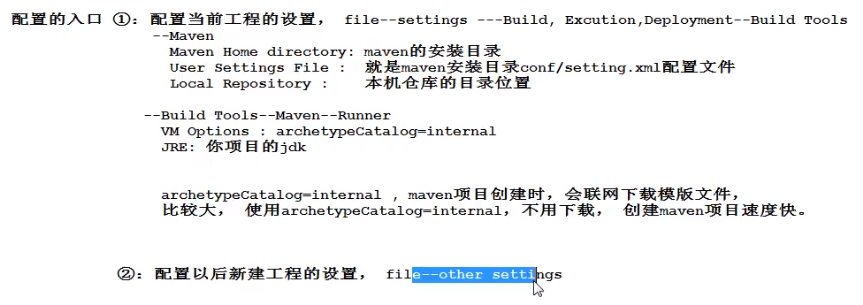
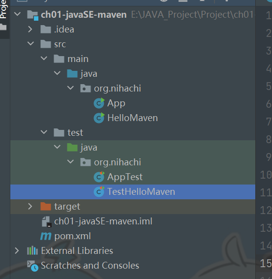
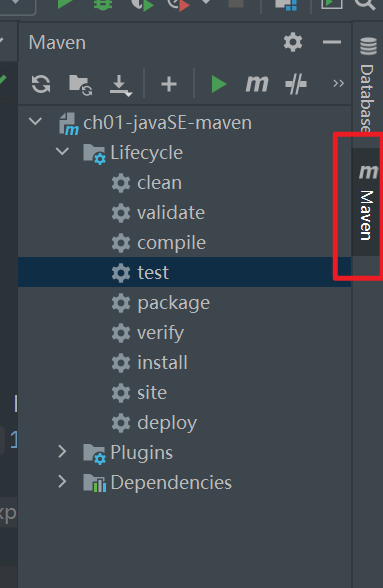

# Maven

> 项目管理工具 —— maven
>
> 传统开发项目，没有maven管理导致：
>
> 1. 很多模块，模块之间存在关系，手工管理这些关系会比较繁琐
> 2. 需要许多的第三方功能，导致会有许多jar文件，需要手工进行下载
> 3. 需要手工管理jar包的版本
> 4. 管理jar文件之间的依赖（如a.jar需要使用b.jar中的类，必须首先获取b.jar才能可以使用a.jar）
>
> 为了解决这些问题，maven应运而生：
>
> 1. maven可以管理jar文件
> 2. 自动下载jar和他的文档，源代码
> 3. 管理jar直接的依赖（a.jar需要b.jar，则maven自动下载b.jar）
> 4. 管理需要的jar版本
> 5. 帮忙编译程序，把java编译为class
> 6. 帮忙测试代码是否正确
> 7. 帮忙打包文件为jar文件，或者war文件
> 8. 帮忙部署项目
>
> 官网：https://maven.apache.org

----

## Maven支持的构建

> 构建时面向过程的，含有一些步骤，完成项目代码的编译、测试、运行、打包、部署等等。

**Maven支持的构建包括有：**

1. 清理：把之前项目编译的东西删除，为新的编译代码做准备
2. 编译：把程序源代码编译为执行代码，java->class文件；批量处理，可以同时把成千上百的文件编译为class；而javac不一样，一次只能编译一个文件
3. 测试：Maven可以执行测试程序代码，验证你的功能是否正确；批量执行，Maven同时执行多个测试代码，同时测试很多功能
4. 报告：生成测试结果的文件，测试是否通过
5. 打包：把项目中的所有class文件，配置文件等所有资源放到一个压缩文件中。该压缩文件就是项目的结果文件，通常为java程序，压缩文件以.jar为扩展名。对于web应用，压缩文件以.war为扩展名。
6. 安装：把打包生成的文件安装到本地仓库
7. 部署：把程序安装好以供执行

----

## Maven核心概念

### POM

> 一个文件，名称为pom.xml —— 翻译为项目对象模型
>
> maven将一个项目当作一个模型使用，控制maven构建项目的过程，管理jar依赖

### 约定的目录结构

> maven项目的目录和文件的位置都是固定的

### 坐标

> 一个唯一的字符串，可以用来表示资源

### 依赖管理

> 管理项目可以使用的jar文件

### 仓库管理

> 资源存放的位置

### 生命周期

> Maven工具构建项目的过程，就是生命周期
>
> 生命周期即Maven构建项目的过程，清理，编译，测试，报告，打包，安装，部署

### 插件和目标

> 执行maven构建的时候使用的工具就是插件

### 继承

### 聚合

----

## Maven工具的安装与配置

### 子目录

+ bin —— 执行程序，主要是mvn.cmd
+ conf —— maven工具本身的配置文件 settings.xml

### 配置环境变量

+ 在系统的环境变量中，指定一个M2_HOME的名称，指定他的值为maven工具的安装目录（bin之前的目录）
+ 将M2_HOME配置到path之中
  + %M2_HOME%\bin
  + %M2_HOME%\jre\bin

---

## Maven工程约定的目录结构、编译方法与资源下载地址

### Maven中约定的目录结构

Hello

- -- src
  - -- main	# 放主程序java代码和配置文件
    - -- java     # 程序包和包中的java文件
    - -- resources     # java程序中要使用的配置文件
  - -- test	  # 放测试程序代码和文件（可以没有）
    - -- java     # 测试程序包和包中的java文件
    - -- resources     # 测试java程序中要使用的配置文件
- -- pom.xml（Maven项目必须有）

### 资源下载地址

下载资源默认地址：C:\Users\(登录用户名)Administrator\.m2\repository

中央仓库的地址：https://repo.maven.apache.org

修改方法：

1. 修改maven的配置文件，maven安装目录\conf\settings.xml（建议先备份）
2. 修改localRepository指定你的目录（不要使用中文目录）

比如修改到 —— D:\work\maven_work\maven_repository

### 仓库

> 存放maven使用的jar和我们项目所使用的jar

仓库的分类：

* 本地仓库 —— 个人计算机上的文件夹，存放各种jar
* 远程仓库 —— 互联网上的仓库，使用网络才能使用
  * 中央仓库：最权威，所有的开发人员都共享使用的一个集中的仓库
  * 中央仓库镜像：中央仓库的备份，在各大洲，重要城市都有镜像
  * 私服：公司内部，在局域网中使用，不是对外使用的

仓库的使用（maven仓库的使用不需要人为参与）

开发人员需要使用mysql驱动 ---> maven首先查本地仓库 ---> 私服 ---> 镜像 ---> 中央仓库

### 编译



🙋‍ 必须在pom.xml的目录下执行，执行mvn compile，结果会在项目的根目录下生成target目录（结果目录），maven编译的java程序，最后的class文件都放在target目录中

---

## POM文件

> 项目对象模型POM —— ProjectObjectModel

### 基本信息

* modelVersion —— Maven模型的版本
* groupId —— 组织id，一般是公司域名的倒写（com.baidu.appolo）
* artifactId —— 项目名称，也是模块名称，对应groupId中项目中的子项目
* version —— 项目版本号。如果在开发中，是不稳定版本，在版本后带-SNAPSHOT
* packaging —— 项目打包的类型，可以是jar\war\rar\ear\pom，默认为jar

🙋‍ groupId、artifactId、version三个属性称为坐标（gav），可以在互联网上唯一的标识项目




### 依赖

> dependencies 和 dependency，相当于java代码中的import
>
> 你的项目中要使用的各种资源说明




### 配置属性

> properties
>
> 用来定义一些配置属性，例如project.build.sourceEncoding（项目构建源码编码方式），可以设置为UTF-8，防止中文乱码，也可以顶以相关构建版本号，便于日后统一升级

### 构建

> build
>
> 表示与构建相关的配置，例如设置编译插件的jdk版本

---

## Maven的常用命令

```java
mvn clean			//清理（删除原来编译和测试的目录，即target目录，但是已经install到仓库里的包不会删除）
mvn compile			//编译main/java（会在当前目录下生成一个target，里面存放编译主程序之后生成的字节码文件，即编译main/java/目录下的java位class文件，同时把class拷贝到target/classes目录下面，将main/resources目录下的所有文件都拷贝到target/classes目录下）
mvn test-compile	//编译测试程序test/java
mvn test			//测试（会生成一个目录surefire-reports存放测试结果）
mvn package			//打包主程序（直有main目录下的内容）
mvn install			//安装主程序（安装到本地仓库，使用的时候即利用gav）
mvn deploy			//部署主程序，一般不用
```

而Maven真正完成功能的是插件，插件即一些jar文件，一些类

**🙋‍ 单元测试（测试方法）**

* 单元测试使用的是junit，junit是一个专门测试的框架（工具）
* junit测试的内容：测试的是类中的方法，每一个方法都是独立测试的。方法是测试的基本单位（单元）
* Maven借助单元测试，批量的测试类中的大量方法是否符合预期的

**使用方法：**

> 在Maven项目中的src/test/java目录下，创建测试程序

推荐的创建类和方法的提示：

1. 测试类的名称：是Test + 你要测试的类名
2. 测试的方法名称是：Test + 方法名称

* 例如要测试HelloMaven
* 创建测试类TestHelloMaven

```
@Test
public void testAdd(){
	测试HelloMaven的add方法是否正确
}
```

🙋‍ 其中testAdd教作测试方法，他的定义规则：

1. 方法是public的，必须
2. 方法没有返回值，必须
3. 方法名称是自定义的，推荐是Test + 方法名称
4. 在方法的上面加入@Test

```java
import org.junit.Assert;
import org.junit.Test;

public class TestHelloMaven{
	@Test
	public void testAdd(){
		System.out.println("===maven junit testAdd()===");
		HelloMaven hello = new HelloMaven();
		int res = hello.add(10,20);
		//验证10+20是不是30，junit提供的方法，用来对比结果
		//assertEquals(期望值，实际值)，如果两个值相等证明是正确的，不等则抛异常
		Assert.assertEquals(30,res);
	}
}
```

----

## 编译插件配置

```xml
<!-- 控制配置maven构建项目的参数设置，设计jdk版本-->
<build>
    <!--配置插件-->
    <plugins>
        <!-- 配置具体的插件 -->
    	<plugin>
        	<groupId>org.apache.maven.plugins</groupId>
            <!--插件的名称-->
            <artifactId>maven-compiler-plugin</artifactId>
            <!--插件的版本-->
            <version>3.8.1</version>
            <!--配置插件的信息-->
            <configuration>
                <!--告诉maven 我们写的代码是在jdk1.8上编译的-->
            	<source>1.8</source>
                <target>1.8</target>
            </configuration>
        </plugin>
    </plugins>
</build>
```

----

## IDEA中设置Maven并结合使用

> 在idea中有内置的maven，但一般不用，因为修改内置maven的设置不方便
>
> 使用自己安装的maven，需要覆盖idea中的默认设置

### 配置的入口

* 配置当前工程的设置：file--settings
* 配置以后新建工程的设置：file--settings--other settings



🙋‍ 其中更正为：-DarchetypeCatalog=internal

### **配置后测试例子**

利用模板创建项目：

* maven-archetype-quickstart：普通的java项目
* maven-archetype-webapp：web工程

目录结构



🙋‍ 没有resources属于正常情况，可以自己创建，并右键mask as resources

```java
package org.nihachi;

public class HelloMaven {

    public int add(int a,int b){
        return a+b;
    }

    public static void main(String[] args) {
        HelloMaven helloMaven = new HelloMaven();
        int res = helloMaven.add(10,20);
        System.out.println("10+20=" + res);
    }
}
```

```java
//测试
package org.nihachi;

import org.junit.Assert;
import org.junit.Test;

public class TestHelloMaven {

    @Test
    public void testAdd(){
        HelloMaven hello = new HelloMaven();
        int add = hello.add(10, 20);
        //判断结果是否正确
        Assert.assertEquals(30,add);
    }
}
```

生命周期（双击操作）



以及插件和依赖（a用b...）

----

